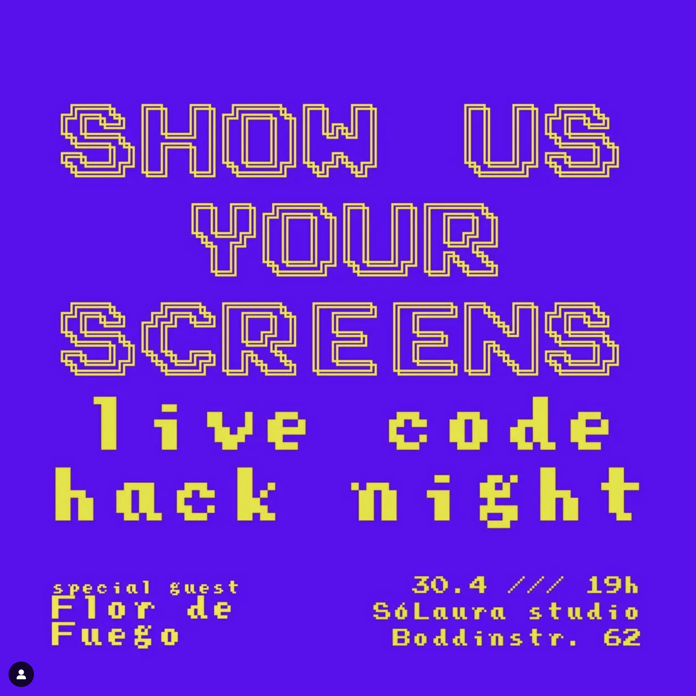

# Live coding workshop 
## ✨ visuals ✨  
27-04-25

**WIFI:** Cave Guest
**PASSWORD:** UncleJohn3-16
**website**: https://lauraporta.github.io/livecoding_workshop/
---

## Presentations

<!--  ADD MORE PHOTOS -->
  
---

## What is live coding 
**Live coding** is an artistic practice that combines programming and real-time performance.  

<iframe width="560" height="315" src="https://www.youtube.com/embed/FmE_yUIz4lQ?start=300" title="YouTube video" frameborder="0" allow="accelerometer; autoplay; clipboard-write; encrypted-media; gyroscope; picture-in-picture" allowfullscreen></iframe>

Bogdan and Pablo in a metal live coding set 🤘🏻

---

## Show the how

---

## Algorave ~ Resident Advisor

<iframe width="560" height="315" src="https://www.youtube.com/embed/S2EZqikCIfY" title="YouTube video" frameborder="0" allow="accelerometer; autoplay; clipboard-write; encrypted-media; gyroscope; picture-in-picture" allowfullscreen></iframe>

---
## Jams
Pastagang 🍝
<iframe width="560" height="315" src="https://www.youtube.com/embed/FmE_yUIz4lQ?start=1800" title="YouTube video" frameborder="0" allow="accelerometer; autoplay; clipboard-write; encrypted-media; gyroscope; picture-in-picture" allowfullscreen></iframe>

<!-- links to nudel and flock? -->
---
## Visual

- [Hydra live coding video synth](https://hydra.ojack.xyz/)
- javascript (p5.js, three.js, etc.)
- [pure data](https://puredata.info/) (node based)
- [touchdesigner](https://www.derivative.ca/) (node based)
- any other tool you like (shaders, python, c++, ...)

---

## Sound

- [strudel](https://strudel.cc/)
- [TidalCycles](https://tidalcycles.org/)
<!--  ADD MORE SOUND EXAMPLES -->
---

## Discover more live coding events

- In London [see the schedule @ badlondon.events](https://badlondon.events)
<!-- add more events -->

---

## The right tool

- reactivity
- immediacy
- few characters per function
- excellent design choices

---
## [hydra](https://hydra.ojack.xyz/) meets these requirements
- created by [Olivia Jack](https://ojack.xyz)
- open source 
- in the browser
- JS ecosystem
- can also be used locally on Atom
---

## The basic concepts of Hydra

Hydra is based on **sources** and **modifiers**:

**🔹 Sources:** `osc()`, `voronoi()`, `gradient()`, `src()`, `shape()`, ...  
**🔸 Modifiers:** `kaleid()`, `pixelate()`, `modulate()`, `blend()`, `contrast()`... 

But also audio and video input!

---
## Documentation
👉🏻 https://hydra.ojack.xyz/docs/docs/learning/

---
## Demo 1
Let's start with a random sketch.  
👉🏻 https://hydra.ojack.xyz/

---
## Demo 2
Let's collaborate together on a sketch.  
👉🏻 https://flok.cc/s/secondary-red-tick-23b42372#targets=hydra&c0=

---
## Demo 3
Let's go to Nudel 🍝  
��🏻 https://nudel.cc/

---
## Ways to use Hydra

- 🎨 Solo improvisation 
- 🧪 Intentional creation
- 🫂 Collaborative jams

---
## Expanding hydra
- 🧩 Custom extensions 
  - [shaders for hydra](https://gitlab.com/metagrowing/extra-shaders-for-hydra)
  - [bogdan's shaders](https://github.com/boggodan/boggohydra)
- 🔌 Integration with other libraries
  - p5.js
  - three.js
- ➕ Python?
